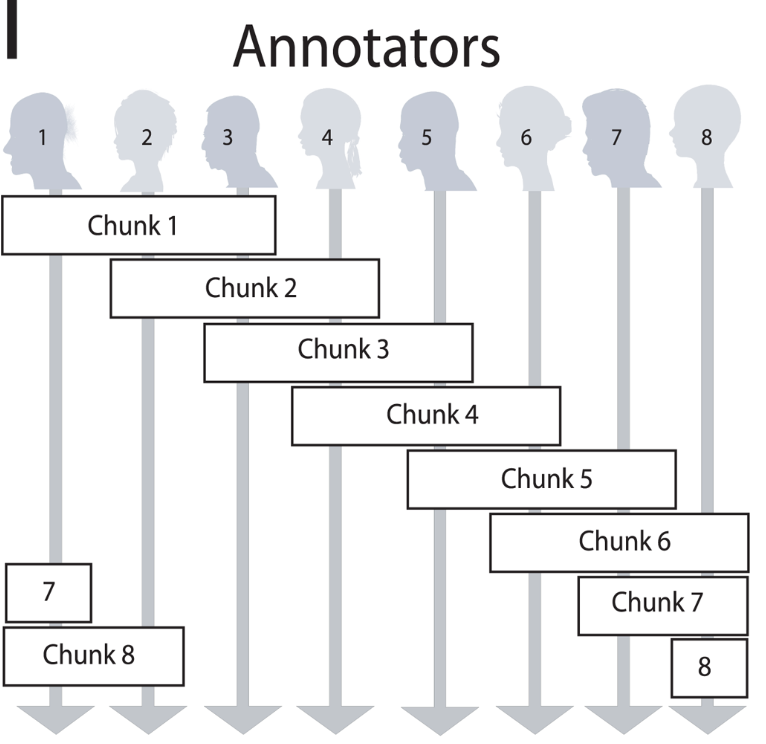
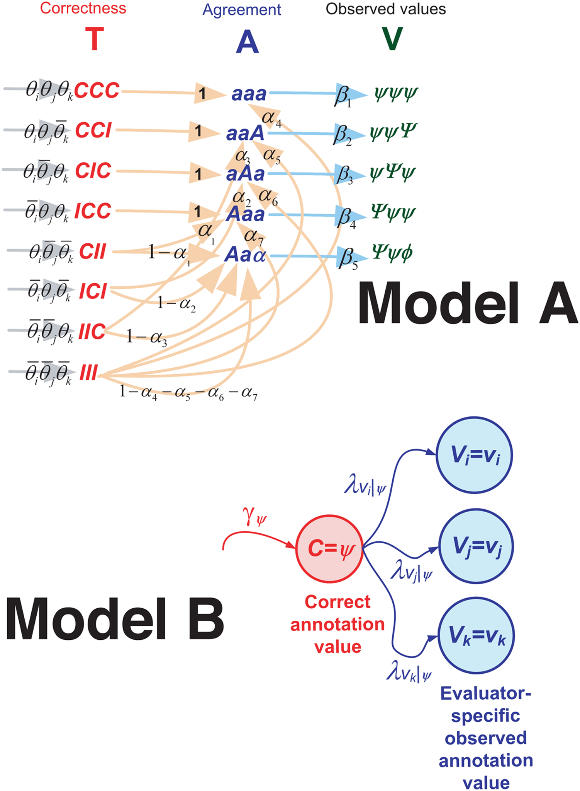

# Week 5 - Sampling & Reliability

Up until this week, we have assumed that the corpus you have used for analysis
assignments represented a *meaningful* assemblage of texts from which reasonable
inferences could be drawn about the social game, social world and social actors
that produced it. This week, we ask you to articulate what your sample
represents in context of your final project, and draw upon methods we have
developed over the last three weeks to draw reasonable and representative
samples.

This week we also pivot from our recent work on unsupervized machine learning
approaches to explore how we can get *human* readings of content at scale. We
want to gather and utilize human responses for several reasons. First, we may
want to use crowdsourced human scores as the primary method of coding,
extracting or organizing content (as it was in the two of the assigned
readings). Second, we may want to validate or tune a computational algorithm we
may have developed in terms of how it is associated with human meanings or
experience. Finally, we may want to use human coding on a sample of data as the
basis for training a model or algorithm to then extrapolate *human-like*
annotations to the entire population. Here intelligent sampling is critical to
maximize effective maching training.

For this notebook we will be using the following packages

```python
#All these packages need to be installed from pip
import numpy as np #For arrays
import scipy as sp #For some stats
import pandas #Gives us DataFrames
import matplotlib.pyplot as plt #For graphics
import seaborn #Makes the graphics look nicer
import pyanno #On python3 make sure to pip install pyanno3

#We need to import these this way due to how pyanno is setup
from pyanno.measures import pairwise_matrix, agreement, cohens_kappa, cohens_weighted_kappa, fleiss_kappa, krippendorffs_alpha, pearsons_rho, scotts_pi, spearmans_rho
from pyanno.annotations import AnnotationsContainer
from pyanno.models import ModelA, ModelBt, ModelB

from functools import reduce
from itertools import permutations
import math


#This 'magic' command makes the plots work better
#in the notebook, don't use it outside of a notebook.
#Also you can ignore the warning
%matplotlib inline

import os #For looking through files
import os.path #For managing file paths
```

## <span style="color:red">*Pitch Your Project*</span>

<span style="color:red">In the three cells immediately following, describe
**WHAT** you are planning to analyze for your final project (i.e., texts,
contexts and the social game, world and actors you intend to learn about through
your analysis) (<200 words), **WHY** you are going to do it (i.e., why would
theory and/or the average person benefit from knowing the results of your
investigation) (<200 words), and **HOW** you plan to investigate it (i.e., what
are the approaches and operations you plan to perform, in sequence, to yield
this insight) (<400 words).

## ***What?***
<200 words

## ***Why?***
<200 words

## ***How?***
<400 words

## <span style="color:red">*Pitch Your Sample*</span>

<span style="color:red">In the cell immediately following, describe the
rationale behind your proposed sample design for your final project. What is the
social game, social work, or social actors you about whom you are seeking to
make inferences? What are its virtues with respect to your research questions?
What are its limitations? What are alternatives? What would be a reasonable path
to "scale up" your sample for further analysis (i.e., high-profile publication)?
(<200 words).

## ***Which (words)?***
<300 words

## <span style="color:red">*Your turn*</span>

<span style="color:red">In the cells immediately following, demonstrate three
approaches drawn from any of the last three weeks to create subsamples of your
corpus (e.g., for crowd-sourced subcoding like we'll be doing this week).
Methods of subsampling include (a) corpus linguistic approaches drawing on word
presence or co-presence, conditional frequencies, weighted words (e.g., tf.idf),
KL or JS divergences, etc.; (b) hierarchical or flat clustering approaches; (c)
topic modeling; or (d) word-embedding. (<200 words).

# Example Annotation Dataset

Load Rzhetsky et al (2009)'s sample dataset, which can be found
[here](https://github.com/enthought/uchicago-pyanno/tree/master/data). This data
is the result of a content analytic / content extraction study in which Andrey
Rzhetsky and colleagues from the National Library of Medicine, published [here](
http://journals.plos.org/ploscompbiol/article?id=10.1371/journal.pcbi.1000391)
in [PLOS Computational Biology](http://journals.plos.org/ploscompbiol/), gave
eight annotators 10,000 sentence chunks from biomedical text in biomedical
abstracts and articles, then asked them, in a loop design schematically
illustrated below that provided 3 independent codings for each document. The
sampling strategy pursued diversity by drawing from PubMed abstracts (1000) and
full-text articles (9000: 20% from abstracts, 10% from introductions, 20% from
methods, 25% from results, and 25% from discussions.) The dataset extract here
involves respondents codes for sentences in terms of their *Evidence*: {0, 1, 2,
3, -1} where 0 is the complete lack of evidence, 3 is direct evidence present
within the sentence, and -1 is didn't respond. (They also crowdsourced and
analyzed *polarity*, *certainty*, and *number*). For example, consider the
following two abutting sentence chunks: *"Because null mutations in toxR and
toxT abolish CT and TcpA expression in the El Tor biotype and also attenuate
virulence..."* [i.e., average certainty = 0], *"...it is likely that the ToxR
regulon has functional similarities between the two biotypes despite the clear
differences in the inducing parameters observed in vitro"* [i.e., average
certainty = 1]." 

```python
x = np.loadtxt("data/testdata_numerical.txt")
anno = AnnotationsContainer.from_array(x, missing_values=[-1])
```

Interrogate the AnnotationsContainer object.

```python
anno.annotations
```

```python
anno.labels
```

```python
anno.missing_values
```

# Annotation Statistics

First, we assume categorical codes...that each code is qualitatively distinct
from each other. Two measures are primarily used for this: Scott's $\pi$,
Cohen's $\kappa$, and Krippendorff's $\alpha$ which each measure the extent of
agreement between two annotators, but take into account the possibility of the
agreement occurring by chance in slightly different ways. Any agreement measure
begins with the frequency of codes:

```python
pyanno.measures.agreement.labels_frequency(anno.annotations,4)
```

Now consider the "confusion matrix" or matrix of coded agreements between any
two coders:

```python
c = pyanno.measures.agreement.confusion_matrix(anno.annotations[:,0], anno.annotations[:,1],4)
print(c)
ac = seaborn.heatmap(c)
plt.show()
```

Scott's $\pi$ is computed as:

$\pi = \frac{\text{Pr}(a)-\text{Pr}(e)}{1-\text{Pr}(e)}$

Where Pr($a$) is relative observed agreement, and Pr($e$) is expected agreement
using joint proportions calculated from the confusion matrix or matrix of coded
agreements between any two coders:

```python
scotts_pi(anno.annotations[:,0], anno.annotations[:,1])
```

The generalization of Scott's $\pi$ to $n$ coders is Fleiss' $\kappa$ (Fleiss
called it $\kappa$ because he thought he was generalizing Cohen's $\kappa$)

```python
fleiss_kappa(anno.annotations[::])
```

Krippendorff's $\alpha$ generalizes of Fleiss' $\kappa$ to $n$ coders and takes
into account the fact that annotations here are not categorically different, but
ordinal, by adding a weight matrix in which off-diagonal cells contain weights
indicating the seriousness of the disagreement between each score. When produced
with no arguments, it simply produces an arithmetic distance (e.g., 3-1=2), such
that cells one off the diagonal are weighted 1, two off 2, etc.

```python
krippendorffs_alpha(anno.annotations[::])
```

Like Scott's $\pi$, Cohen's $\kappa$ also takes into account the possibility of
the agreement occurring by chance, but in the following way:

$\kappa = \frac{p_o-p_e}{1-p_e}=1-\frac{1-p_o}{p_e}$

where $p_o$ is the relative observed agreement among raters, and $p_e$ is the
hypothetical probability of chance agreement, using the observed data to
calculate the probabilities of each observer randomly saying each category. If
the raters are in complete agreement then $\kappa = 1$. If there is no agreement
among the raters other than what would be expected by chance (as given by
$p_e$), $\kappa ≤ 0 $. Here, Cohen's $\kappa$ statistic for the first two
annotators is computed. This is probably the most common metric of agreement.

```python
cohens_kappa(anno.annotations[:,0], anno.annotations[:,1])
```

```python
m = pairwise_matrix(cohens_kappa, anno.annotations)
print(m)
```

```python
ax = seaborn.heatmap(m)
plt.show()
```

You can see that this 8 by 3 loop design will be less stable than an 8 choose 3
combinatorial design, because each codes with more others.

One can also assess the average Cohen's $\kappa$ for all pairs of coders that
have coded against one another:

```python
def pairwise_metric_average(metric, array):
    """Calculate the pairwise metric average for the real elements of metric function run on an array of annotations"""
    p = permutations(range(array[0,:].size),2)
    m = [metric(array[:,x[0]], array[:,x[1]]) for x in p]
    clean_m = [c for c in m if not math.isnan(c)]
    return reduce(lambda a, b: a + b, clean_m)/len(clean_m)    
 
pairwise_metric_average(cohens_kappa, anno.annotations)
```

As recognized with Krippendorff's flexible $\alpha$, our scores are *not*
categorical, but rather ordered and her considered metric. Weighted $\kappa$
allows you to count disagreements differently and is useful when codes are
ordered as they are here. Here a weight matrix is added to the calculation, in
which off-diagonal cells contain weights indicating the seriousness of the
disagreement between each score. When automatically produced, it simply produces
an arithmetic distance (e.g., 3-1=2), such that cells one off the diagonal are
weighted 1, two off 2, etc. Here

$\kappa = 1-\frac{\sum^k_{i=1}\sum^k_{j=1}w_{ij}x_{ij}}{\sum^k_{i=1}\sum^k_{j=1}
w_{ij}m_{ij}}$

where $\kappa$ = $n$ codes and $w_{ij}$,$x_{ij}$, and $m_{ij}$ represent
elements in the weight, observed, and expected matrices, respectively.
(Obviously, when diagonal cells contain weights of 0 and off-diagonal cells
weights of 1, this equals $\kappa$).

```python
cohens_weighted_kappa(anno.annotations[:,0], anno.annotations[:,1])
```

Or averaged over the total:

```python
pairwise_metric_average(cohens_weighted_kappa,anno.annotations)
```

Alternatively, if the annontation data can be understood as indicating real
values, we can assess not agreement, but rather the correlation of values
(Pearson's $\rho$) or correlation of ranks (Spearman's $\rho$) for pairs of
coders:

```python
n = pairwise_matrix(pearsons_rho, anno.annotations)
m = pairwise_matrix(spearmans_rho, anno.annotations)
an = seaborn.heatmap(n)
plt.show()
am = seaborn.heatmap(m)
plt.show()
```

Or averaged over all comparable pairs:

```python
print(pairwise_metric_average(pearsons_rho,anno.annotations), pairwise_metric_average(spearmans_rho,anno.annotations))
```

## <span style="color:red">*Your turn*</span>

<span style="color:red">Perform a content annotation survey of some kind in
which at least 3 people evaluate and code each piece of content, using Amazon
Mechanical Turk as described in the MTurk slides in the Assignment link on
Chalk, or by hand with friends.  With the resulting data, calculate, visualize
and discuss inter-coder agreement or covariation with appropriate metrics. What
does this means for the reliability of human assessments regarding content in
your domain?

# Models

However, what if some coders are better than others. The prior measures all rely
on the assumption that all coders are equally good. What if some are worse than
others? Now we use Rzhetsky et al (2009) and Dawid & Skene's models to make
inference about true label classes by downweighting bad or deviant coders.
Pyanno provides three relevant models: ModelA, ModelB, and ModelBt. Model A can
only be currently run on a balanced 8-coder design, but assesses accuracy purely
based on agreement. Model B with $\theta$s models the relationship between each
coder and code. Model B is the Dawid & Skene model from the reading. The
following image schematically suggests the relationship between the models. 

The models should provide similar results. To estimate the parameters for any
models, we first need to create a new model.

```python
# create a new instance of model A, with 4 label classes
model = ModelA.create_initial_state(4)
# other model parameters are initialized from the model prior
print(model.theta)
print(model.log_likelihood(anno.annotations))
```

Pyanno allows one to use either MLE (maximum likelihood estimation) or MAP
(maximum a posteriori estimation) to estimate model parameters. Note that the
parameters here correspond to our estimation of the accuracy of each annotator.

```python
model.map(anno.annotations)
print(model.theta)
print(model.log_likelihood(anno.annotations))
```

```python
model = ModelA.create_initial_state(4)
model.mle(anno.annotations)
print(model.theta)
print(model.log_likelihood(anno.annotations))
```

Once we have model parameters estimated, we can now make inferences about the
true label classes. We can calculate the posterior distribution over the true
label classes.

```python
posterior = model.infer_labels(anno.annotations)
print(posterior)
```

Let's turn the posterior of the first 100 samples into a heatmap.

```python
ax = seaborn.heatmap(posterior[:10,])
plt.show()
```

This differs markedly from taking annotator scores at face value (Add comparison
of average values)

```python
samples = model.sample_posterior_over_accuracy(anno.annotations, 200, burn_in_samples=100, thin_samples=3)
print(samples.mean(axis=0))
print(samples.std(axis=0))
```

Let's try everything again with ModelBt

```python
# create a new instance of model B, with 4 label classes and 8 annotators.
model = ModelBt.create_initial_state(4, 8)
print(model.theta)
print(model.log_likelihood(anno.annotations))
```

```python
model.map(anno.annotations)
print(model.theta)
print(model.log_likelihood(anno.annotations))
```

```python
posterior = model.infer_labels(anno.annotations)
print(posterior)
```

Let's visualize the posterior of the first 10 samples according to ModelBt.

```python
ax = seaborn.heatmap(posterior[:10,])
plt.show()
```

The property of these scores is that they enable us to identify the most likely
code assuming coders of unequal quality, which also allows us to break ties when
we know coder identity. For some analyses, we may simply use the posterior
themselves rather than the most probably code outcome.

# Generating Annotations

Pyanno also allows one to generate artificial data from a model.

```python
model = ModelBt.create_initial_state(4, 3, theta=[0.99,0.75,0.25])
#randome generate annotations with 4 label classes and 3 annotators. The accuracy of the three annotators are 0.99, 0.75, and 0.25 respectively.
model.generate_annotations(20)
```

## Visualizing coder accuracy

Pyanno provides a [graphical user interface](http://docs.enthought.com/uchicago-
pyanno/user_guide.html) for making plots. However, it is not compatible with
ipyton notebook. Nevertheless, nothing prevents us from making plots using
matplotlib. Let's make a plot of the accuracy of each annotator inferred from
ModelA.

```python
model = ModelA.create_initial_state(4)
model.mle(anno.annotations)
samples = model.sample_posterior_over_accuracy(anno.annotations, 200, burn_in_samples=100, thin_samples=3)
y =  samples.mean(axis=0)
y_ci = samples.std(axis=0)
```

```python
plt.figure()
plt.errorbar(range(8),y, yerr = y_ci)
plt.show()
```

# Example with articles that use the General Social Survey

Getting the data for each content analysis survey regarding how GSS variables
were used in a large population of social science articles.

```python
#anno_vdep = AnnotationsContainer.from_file(missing_values=[-1], filename="GSSvariable_testSdependent.csv")
dev = np.loadtxt(fname="data/dataforgssstudy/n7GSSvariable_testSdependent.csv", dtype=int, delimiter=",")
anno_dv = AnnotationsContainer.from_array(dev)

ind = np.loadtxt(fname="data/dataforgssstudy/n7GSSvariable_testSindependent.csv", dtype=int, delimiter=",")
anno_iv = AnnotationsContainer.from_array(ind)

cent = np.loadtxt(fname="data/dataforgssstudy/n7GSSvariable_testScentral.csv", dtype=int, delimiter=",")
anno_cv = AnnotationsContainer.from_array(cent)

cont = np.loadtxt(fname="data/dataforgssstudy/n7GSSvariable_testScontrol.csv", dtype=int, delimiter=",")
anno_ctv = AnnotationsContainer.from_array(cont)

test = np.loadtxt(fname="data/dataforgssstudy/testH.csv", dtype=int, delimiter=",")
anno_test = AnnotationsContainer.from_array(test)
```

Let's examine the data structure.

```python
dev.shape
```

```python
anno_dv.labels
```

```python
anno_dv.missing_values
```

```python
anno_dv.annotations.shape
```

First, let's use Cohen's $\kappa$ to measure agreement between coders...

```python
m = pairwise_matrix(cohens_kappa, anno_dv.annotations)
print(m)
```

Let's visualize that...

```python
ax = seaborn.heatmap(m)
plt.show()
```

```python
pairwise_metric_average(cohens_kappa, anno_dv.annotations)
```

Let's compute the statistics on each of the datasets and with Pearson's $\rho$.

```python
datasets = [anno_dv.annotations, anno_iv.annotations, anno_cv.annotations, anno_ctv.annotations]
ck = [pairwise_matrix(cohens_kappa, anno) for anno in datasets]
pr = [pairwise_matrix(pearsons_rho, anno) for anno in datasets]
titles = ['DV', 'IV', 'Central Variable', "Control Variable"]
```

```python
fig, axs = plt.subplots(2,4)
fig.set_size_inches(18, 7)
for k, ax, title in zip(ck,axs[0], titles):
    seaborn.heatmap(k, ax = ax)
    ax.set_title(title)
    ax.set_xticks(())
    ax.set_yticks(())
for r, ax in zip(pr,axs[1]):
    seaborn.heatmap(r, ax = ax)
    ax.set_xticks(())
    ax.set_yticks(())
plt.show()
```

Now we will compare the student coders.

```python
nondiag = (np.eye(6)-np.ones(6))*-1.0
```

```python
xdevck = pairwise_matrix(cohens_kappa, anno_dv.annotations)
xdevpr = pairwise_matrix(pearsons_rho, anno_dv.annotations)

xindck = pairwise_matrix(cohens_kappa, anno_iv.annotations)
xindpr = pairwise_matrix(pearsons_rho, anno_iv.annotations)

xcenck = pairwise_matrix(cohens_kappa, anno_cv.annotations)
xcenpr = pairwise_matrix(pearsons_rho, anno_cv.annotations)

xconck = pairwise_matrix(cohens_kappa, anno_ctv.annotations)
xconpr = pairwise_matrix(pearsons_rho, anno_ctv.annotations)

print(np.average(xdevck, weights=nondiag))
print(np.average(xdevpr, weights=nondiag))
print(np.average(xindck, weights=nondiag))
print(np.average(xindpr, weights=nondiag))
print(np.average(xcenck, weights=nondiag))
print(np.average(xcenpr, weights=nondiag))
print(np.average(xconck, weights=nondiag))
print(np.average(xconpr, weights=nondiag))
```

Now we are going to bring in "gold standard" data. In this case, this is where
we asked authors of the articles to code their own article's variables and
compare with our student coders.

```python
mergedata = np.loadtxt(fname="data/dataforgssstudy/gss_mergedataC.txt", dtype=int, delimiter="\t")
```

```python
anno_merge_dep = AnnotationsContainer.from_array(mergedata[:,0:2])
anno_merge_ind = AnnotationsContainer.from_array(mergedata[:,2:4])
anno_merge_cen = AnnotationsContainer.from_array(mergedata[:,4:6])
anno_merge_con = AnnotationsContainer.from_array(mergedata[:,6:8])
anno_merge_dkn = AnnotationsContainer.from_array(mergedata[:,8:10])
```

```python
print("""Dependent variable -- kappa & rho""")
print(cohens_kappa(anno_merge_dep.annotations[:,0], anno_merge_dep.annotations[:,1]))
print(pearsons_rho(anno_merge_dep.annotations[:,0], anno_merge_dep.annotations[:,1]))

print("\nIndependent variable")
print(cohens_kappa(anno_merge_ind.annotations[:,0], anno_merge_ind.annotations[:,1]))
print(pearsons_rho(anno_merge_ind.annotations[:,0], anno_merge_ind.annotations[:,1]))

print("\nCentral variable")
print(cohens_kappa(anno_merge_cen.annotations[:,0], anno_merge_cen.annotations[:,1]))
print(pearsons_rho(anno_merge_cen.annotations[:,0], anno_merge_cen.annotations[:,1]))

print("\nControl variable")
print(cohens_kappa(anno_merge_con.annotations[:,0], anno_merge_con.annotations[:,1]))
print(pearsons_rho(anno_merge_con.annotations[:,0], anno_merge_con.annotations[:,1]))
```

Whoah! Student coders and authors viewed articles that were "central" or
critical to the published argument as fundamentally different (exhibiting
negative agreement and correlation)

Now for the assessment of the relative values of authors, then student coders.

```python
print("Dependent")
print(np.average(anno_merge_dep.annotations[:,0]))
print(np.average(anno_merge_dep.annotations[:,1]))

print("\nIndependent")
print(np.average(anno_merge_ind.annotations[:,0]))
print(np.average(anno_merge_ind.annotations[:,1]))

print("\nCentral")
print(np.average(anno_merge_cen.annotations[:,0]))
print(np.average(anno_merge_cen.annotations[:,1]))

print("\nControl")
print(np.average(anno_merge_con.annotations[:,0]))
print(np.average(anno_merge_con.annotations[:,1]))
```

## Now we are going to use models to predict the correct annotations

Recall that Model A is built for 8 coders, but we have 6. We're going to *hack*
it by adding two blank columns.

```python
dev.shape
```

```python
negs2 = np.ones((21461, 2), dtype=np.int)*(-1)
devA = np.concatenate((dev, negs2), axis=1)
devA
```

```python
anno_dvA = AnnotationsContainer.from_array(devA)
model_devA = ModelA.create_initial_state(2)
model_devA.theta
```

```python
model_dvB = ModelB.create_initial_state(2, 6)
print(model_dvB.pi)
print(model_dvB.log_likelihood(anno_dv.annotations))
```

```python
model_dvB.map(anno_dv.annotations)
print(model_dvB.pi)
print(model_dvB.log_likelihood(anno_dv.annotations))
```

```python
# compute the posterior distribution over true annotations
posterior_dvB = model_dvB.infer_labels(anno_dv.annotations)
# each row show the probability of each label class for the
# corresponding item
print(posterior)
```

```python
samples_dvB = model_dvB.sample_posterior_over_accuracy(anno_dv.annotations, 200, burn_in_samples=100, thin_samples=3)
```

```python
# we can then compute a credible interval for the parameters:
ci_dv_mean = samples_dvB[0].mean(axis=0)
print("Mean")
print(ci_dv_mean)

ci_dv_stdev = samples_dvB[0].std(axis=0)
print("\nSTD")
print(ci_dv_stdev)

```

We will use Model B estimates for other variable assessments.

```python
#test
model_testB = ModelB.create_initial_state(2, 6)
print(model_testB.log_likelihood(anno_test.annotations))
model_testB.map(anno_test.annotations)
print(model_testB.pi)
print(model_testB.log_likelihood(anno_test.annotations))
print(anno_test.annotations.shape)
posterior_testB = model_testB.infer_labels(anno_test.annotations)
print(posterior_testB.shape)
samples_testB = model_testB.sample_posterior_over_accuracy(anno_test.annotations, 200, burn_in_samples=100, thin_samples=3)
ci_test_mean = samples_testB[0].mean(axis=0)
print(ci_test_mean)
```

```python
#indepedent variables
model_ivB = ModelB.create_initial_state(2, 6)
print(model_ivB.log_likelihood(anno_iv.annotations))
model_ivB.map(anno_iv.annotations)
print(model_ivB.pi)
print(model_ivB.log_likelihood(anno_iv.annotations))
print(anno_iv.annotations.shape)
posterior_ivB = model_ivB.infer_labels(anno_iv.annotations)
print(posterior_ivB.shape)
samples_ivB = model_ivB.sample_posterior_over_accuracy(anno_iv.annotations, 200, burn_in_samples=100, thin_samples=3)
ci_iv_mean = samples_ivB[0].mean(axis=0)
print(ci_iv_mean)

#central variables
model_cvB = ModelB.create_initial_state(2, 6)
print(model_cvB.log_likelihood(anno_cv.annotations))
model_cvB.map(anno_cv.annotations)
print(model_cvB.pi)
print(model_cvB.log_likelihood(anno_cv.annotations))
print(anno_cv.annotations.shape)
posterior_cvB = model_cvB.infer_labels(anno_cv.annotations)
print(posterior_cvB.shape)
samples_cvB = model_cvB.sample_posterior_over_accuracy(anno_cv.annotations, 200, burn_in_samples=100, thin_samples=3)
ci_cv_mean = samples_cvB[0].mean(axis=0)
print(ci_cv_mean)

#control variables
model_ctvB = ModelB.create_initial_state(2, 6)
print(model_ctvB.log_likelihood(anno_ctv.annotations))
model_ctvB.map(anno_ctv.annotations)
print(model_ctvB.pi)
print(model_ctvB.log_likelihood(anno_ctv.annotations))
print(anno_ctv.annotations.shape)
posterior_ctvB = model_ctvB.infer_labels(anno_ctv.annotations)
print(posterior_ctvB.shape)
samples_ctvB = model_ctvB.sample_posterior_over_accuracy(anno_iv.annotations, 200, burn_in_samples=100, thin_samples=3)
ci_ctv_mean = samples_ctvB[0].mean(axis=0)
print(ci_ctv_mean)
```

Now we will package up the predicted data into a format we can use for other,
subsequent analysis:

```python
print(posterior_dvB.shape)
print(posterior_ivB.shape)
print(posterior_cvB.shape)
print(posterior_ctvB.shape)
```

```python
predicted_annotations = np.concatenate((posterior_dvB, posterior_ivB, posterior_cvB, posterior_ctvB), axis=1) # posterior_dvBt, posterior_ivBt, posterior_cvBt, posterior_ctvBt), axis=1)
```

```python
predicted_annotations.shape
```

```python
np.savetxt("B_outputs.txt", predicted_annotations, delimiter='\t')
```

## <span style="color:red">*Your turn*</span>

<span style="color:red">In the cells immediately following, use the results of
your content annotation survey to predict high and low-quality analysts, then
predict MAP estimates for your codes in question. What do these estimates
suggest about the distribution of skill among your coders? How different are
these estimates from a majority vote?

```python

```
