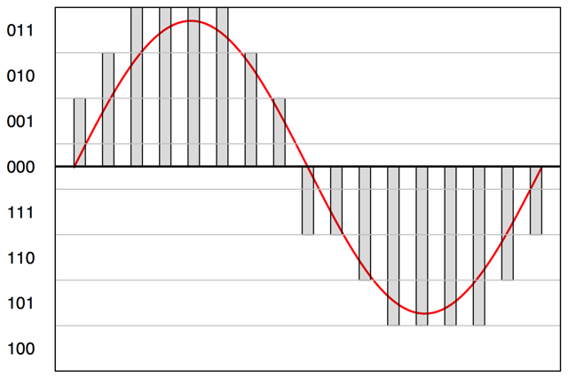

# Week 9 - Beyond Text

This week, we "trascend" text to explore analysis of sound and visual content.
Trillions of digital audio, image, and video files have been generated by cell
phones and distributed sensors, preserved and shared through social medial, the
web, private and government administrations. In this notebook, we read in and
visualize audio and image files, process them to extract relevant features and
measurement, then begin to explore how to analyze and extract information from
them through the same approaches to supervised and unsupervised learning we have
performed thoughout the quarter with text.

For this notebook we will use the following packages:

```python
#All these packages need to be installed from pip
import scipy #For frequency analysis
import scipy.fftpack
import nltk #the Natural Language Toolkit
import requests #For downloading our datasets
import numpy as np #for arrays
import pandas #gives us DataFrames
import matplotlib.pyplot as plt #For graphics
import seaborn #Makes the graphics look nicer
import IPython #To show stuff

#Image handling install as Pillow
import PIL
import PIL.Image
import PIL.ImageOps

#install as scikit-image, this does the image manupulation
import skimage
from skimage.filters import threshold_otsu
from skimage.segmentation import clear_border
from skimage.measure import label, regionprops
from skimage.morphology import closing, square
from skimage.color import label2rgb
from skimage import data
from skimage.feature import blob_dog, blob_log, blob_doh
from skimage.future import graph
from skimage import data, segmentation, color, filters, io
from skimage.util.colormap import viridis
from skimage.color import rgb2gray

#these three do audio handling
import pydub #Requires ffmpeg to be installed
import speech_recognition #install as speechrecognition
import soundfile #Install as pysoundfile 

#This 'magic' command makes the plots work better
#in the notebook, don't use it outside of a notebook.
#Also you can ignore the warning it may generate.
%matplotlib inline

import os
import os.path
import csv
import re
from math import sqrt
```

# Audio analysis

First we will consider media that predates written language...sound and spoken
language. Audio (and video) files come in two major categories, lossy or
lossless. Lossless files save all information the microphone recorded. Lossy
files, by contrast, drop sections humans are unlikely to notice. Recorded
frequencies for both types are then typically compressed, which introduces
further loss. To work with audio files, we want a format that is preferably
lossless or minimally compressed. We will work with `wav` files here. Note that
`mp3` is not acceptable. If you do not have `wav` files, we can use python to
convert to `wav`.

```python
samplePath = 'data/audio_samples/SBC060.mp3'
transcriptPath = 'data/audio_samples/SBC060.trn'
wavPath = '{}.wav'.format('.'.join(samplePath.split('.')[:-1]))
IPython.display.Audio(samplePath)
```

```python
# We are using a different package to convert than the in the rest of the code
def convertToWAV(sourceFile, outputFile, overwrite = False):
    if os.path.isfile(outputFile) and not overwrite:
        print("{} exists already".format(outputFile))
        return
    #Naive format extraction
    sourceFormat = sourceFile.split('.')[-1]
    sound = pydub.AudioSegment.from_file(sourceFile, format=sourceFormat)
    sound.export(outputFile, format="wav")
    print("{} created".format(outputFile))

convertToWAV(samplePath, wavPath)
```

Now that we have created our `wav` file, notice that it is much large than the
source `mp3`. We can load it with `soundfile` and work with it as a numpy data
array.

```python
soundArr, soundSampleRate = soundfile.read(wavPath)
soundArr.shape
```

This is the raw data as a column array, which contains two channels (Left and
Right) of the recording device. Some files, of course, will have more columns.
The array comprises a series of numbers that measure the location of the speaker
membrane (0=resting location). By quickly and rhythmically changing the location
a note can be achieved. The larger the variation from the center, the louder the
sound; the faster the oscillations, the higher the pitch. (The center of the
oscillations does not have to be 0).

```python
soundSampleRate
```

The other piece of information we get is the sample rate. This tells us how many
measurements made per second, which allows us to know how long the entire
recording is:

```python
numS = soundArr.shape[0] // soundSampleRate
print("The sample is {} seconds long".format(numS))
print("Or {:.2f} minutes".format(numS / 60.))
```

The final critical parameter of sound digitization is quantisation, which
consists in assigning a value to each sample according to its amplitude. These
values are attributed according to a bit scale. A quantisation of 8 bit will
assign amplitude values along a scale of $2^8 = 256$ states around 0. Most
recording systems use a $2^{16} = 65536$ bit system. Quantisation is a rounding
process, where high bit quantisation produces values close to reality with
values rounded to a high number of significant digits, and low bit quantisation
produces values further from reality with values rounded a low number of
significants digits. Low quantisation can lead to impaired quality signal.  This figure illustrates how digital sounds is a discrete
process along the amplitude scale: a 3 bit, $2^3=8$, quantization (gray bars)
gives a rough approximation of the sin wave (red line).

Let's look at the first second of the recording:

```python
plt.plot(soundArr[:soundSampleRate])
```

We get 2 (Left and Right) nearly "flat" (or equally wavy) lines. This means that
there is very little noise at this part of the recording. What variation exists
is due to compression or interference and represents the slight hiss you
sometimes hear in low quality recordings.

Let's expand our scope and look at the first 10 seconds:

```python
plt.plot(soundArr[:soundSampleRate * 10])
```

Now we can see definite spikes, where each represents a word or discrete sound.

To see what the different parts correspond to, we can use a transcript. Because
we got this file from the [Santa Barbara Corpus of Spoken American English
](http://www.linguistics.ucsb.edu/research/santa-barbara-corpus#Contents), we
just need to load the metadata, which includes a transcription.

```python
def loadTranscript(targetFile):
    #Regex because the transcripts aren't consistent enough to use csv
    regex = re.compile(r"(\d+\.\d+)\s(\d+\.\d+)\s(.+:)?\s+(.*)")
    dfDict = {
        'time_start' : [],
        'time_end' : [],
        'speaker' : [],
        'text' : [],
    }
    with open(targetFile, encoding='latin-1') as f:
        for line in f:
            r = re.match(regex, line)
            dfDict['time_start'].append(float(r.group(1)))
            dfDict['time_end'].append(float(r.group(2)))
            if r.group(3) is None:
                dfDict['speaker'].append(dfDict['speaker'][-1])
            else:
                dfDict['speaker'].append(r.group(3))
            dfDict['text'].append(r.group(4))
    return pandas.DataFrame(dfDict)

transcriptDF = loadTranscript(transcriptPath)
transcriptDF[:10]
```

Now let's look at a few sub-sections. First, to make things easier, we will
convert the seconds markers to sample indices:

```python
#Need to be ints for indexing, luckily being off by a couple indices doesn't matter
transcriptDF['index_start'] = (transcriptDF['time_start'] * soundSampleRate).astype('int')
transcriptDF['index_end'] = (transcriptDF['time_end'] * soundSampleRate).astype('int')
```

Lets see what `'Rae and I and Sue and Buddy,'` looks like, which is the seventh
row:

```python
subSample1 = soundArr[transcriptDF['index_start'][6]: transcriptDF['index_end'][6]]
plt.plot(subSample1)
```

And now let's hear what that sounds like:

```python
soundfile.write('data/audio_samples/sample1.wav', subSample1, soundSampleRate)
IPython.display.Audio('data/audio_samples/sample1.wav')
```

In order to see sounds in the frequency space, we can take the Fourier
transform. This is a reversible mathematical transform named after the French
mathematician Joseph Fourier (1768-1830) . The
transform decomposes a time series into a sum of finite series of sine or cosine
functions.

```python
sample1FFT = scipy.fftpack.ifft(subSample1)
N = len(sample1FFT)
freq = scipy.fftpack.fftfreq(N, d = 1 / soundSampleRate)
plt.plot(freq[:N//2], abs(sample1FFT)[:N//2]) #Only want positive frequencies
plt.xlabel('Frequency ($Hz$)')
plt.ylabel('Intensity')
```

This shows that there are two frequencies to the 'Rae and I and Sue and Buddy'
snippet: a higher pitched 'Rae and I...Sue...Buddy' (~14000 *Hz*) and the final
two 'and's (one at ~6000 *Hz* and the second at ~8000 *Hz*).

What does a sniff look like?

```python
subSample2 = soundArr[transcriptDF['index_start'][9]: transcriptDF['index_end'][9]]
plt.plot(subSample2)
```

Very different from speech. And now let's see what that sounds like:

```python
soundfile.write('data/audio_samples/sample2.wav', subSample2, soundSampleRate)
IPython.display.Audio('data/audio_samples/sample2.wav')
```

and in frequency space:

```python
sample2FFT = scipy.fftpack.ifft(subSample2)
N = len(sample2FFT)
freq = scipy.fftpack.fftfreq(N, d = 1 / soundSampleRate)
plt.plot(freq[:N//2], abs(sample2FFT)[:N//2]) #Only want positive frequencies
plt.xlabel('Frequency ($Hz$)')
plt.ylabel('Intensity')
```

Notice how there is not a dominant frequency for the sniff as there was for the
noun phrase earlier. This means that the sniff activated noise all across the
frequency spectrum.

We can also investigate dominant frequencies for the entire record:

```python
#This takes a while
fullFFT = scipy.fftpack.ifft(soundArr)
N = len(fullFFT)
freq = scipy.fftpack.fftfreq(N, d = 1 / soundSampleRate)
plt.plot(freq[:N//2], abs(fullFFT)[:N//2]) #Only want positive frequencies
plt.xlabel('Frequency ($Hz$)')
plt.ylabel('Intensity')
```

```python
freq[len(freq)//2 -10:len(freq) // 2 +5]
```

Here we capture each person's frequencies across their entire collection of
statements:

```python
def maxfreq(sample, topN = 10):
    sampleFFT = scipy.fftpack.ifft(sample)
    N = len(sample)
    freqs = scipy.fftpack.fftfreq(N, d = 1 / soundSampleRate)
    tops =  np.argpartition(abs(sampleFFT[:, 0]), -topN)[-topN:]

    return np.mean(tops) 

freqs = []
for i, row in transcriptDF.iterrows():
    freqs.append(maxfreq(soundArr[row['index_start']: row['index_end']]))

transcriptDF['frequency FFT'] = freqs
```

Alan's speech exhibit's the following frequencies:

```python
transcriptDF[transcriptDF['speaker'] == 'ALAN:'].plot( 'time_start', 'frequency FFT')
plt.ylabel("Frequency FFT space")
```

...while Jon's voice is **much** lower:

```python
transcriptDF[transcriptDF['speaker'] == 'JON:'].plot( 'time_start', 'frequency FFT')
plt.ylabel("Frequency FFT space")
```

Or we can look at them togther

```python
fg = seaborn.FacetGrid(data=transcriptDF, hue='speaker', aspect = 3)
fg.map(plt.scatter, 'time_start', 'frequency FFT').add_legend()
```

## <span style="color:red">*Your Turn*</span>

<span style="color:red">Construct cells immediately below this that read in 10
audio files (e.g., produced on your smartphone recorder?) from at least two
different speakers, which include sentences of different types (e.g., question,
statement, exclamation). At least two of these should include recordings of the
two speakers talking to each other (e.g., a simple question/answer). Contrast
the frequency distributions of the words spoken within speaker. What speaker's
voice has a higher and which has lower frequency? What words are spoken at the
highest and lowest frequencies? What parts-of-speech tend to be high or low? How
do different types of sentences vary in their frequency differently? When people
are speaking to each other, how do their frequencies change? Whose changes more?

## Speech-to-Text

We can also do speech recognition on audio, but this requires a complex machine
learning system. Luckily there are many online services to do this. We have a
function that uses Google's API. There are two API's: one is free but limited;
the other is commercial and you can provide the function `speechRec` with a file
containing the API keys, using `jsonFile=` if you wish. For more about this look
[here](https://stackoverflow.com/questions/38703853/how-to-use-google-speech-
recognition-api-in-python) or the `speech_recognition`
[docs](https://github.com/Uberi/speech_recognition).

```python
#Using another library so we need to use files again
def speechRec(targetFile, language = "en-US", raw = False, jsonFile = 'data/googleAPIKeys.json'):
    r = speech_recognition.Recognizer()
    if not os.path.isfile(jsonFile):
        jsonString = None
    else:
        with open(jsonFile) as f:
            jsonString = f.read()
    with speech_recognition.AudioFile(targetFile) as source:
        audio = r.record(source)
    try:
        if jsonString is None:
            print("Sending data to Google Speech Recognition")
            dat =  r.recognize_google(audio)
        else:
            print("Sending data to Google Cloud Speech")
            dat =  r.recognize_google_cloud(audio, credentials_json=jsonString)
    except speech_recognition.UnknownValueError:
        print("Google could not understand audio")
    except speech_recognition.RequestError as e:
        print("Could not request results from Google service; {0}".format(e))
    else:
        print("Success")
        return dat
```

The example above is of too low quality so we will be using another file
`data/audio_samples/english.wav`

```python
speechRec('data/audio_samples/english.wav')
```

## <span style="color:red">*Your Turn*</span>

<span style="color:red">Construct cells immediately below this that use the 10
audio files from at least two different speakers read in previously, attempt to
automatically extract the words from Google, and calculate the word-error rate,
as descibed in Chapter 9 from *Jurafsky & Martin*, page 334. How well does it
do? Under what circumstances does it perform poorly?

# Image analysis

Now we will explore image files. First, we will read in an image:

```python
IPython.display.Image('data/Wikimedia_Conference_2016_–_Group_photo.jpg')
```

```python
image = PIL.Image.open('data/Wikimedia_Conference_2016_–_Group_photo.jpg')
imageArr = np.asarray(image)
imageArr.shape
```

The image we have loaded is a raster image, meaning it is a grid of pixels, each
pixel contains 1-4 numbers giving the amounts of color contained in it. In this
case, we can see it has 3 values per pixel, these are RGB or Red, Green and
Blue. If we want to see just the green we can look at just that array:

```python
plt.imshow(imageArr[:,:,2], cmap='Greens') #The order is R G B, so 2 is the Green
```

Or the others:

```python
plt.imshow(imageArr[:,:,1], cmap='Blues')
```

```python
plt.imshow(imageArr[:,:,0], cmap='Reds')
```

```python
image_gray = PIL.ImageOps.invert(image.convert('L'))
image_grayArr = np.asarray(image_gray)
image_grayArr.shape
```

A grayscale image is defined by its pixel intensities (and a color image can be
defined by its red, green, blue pixel intensities).

```python
plt.imshow(image_gray)
```

## Blob Detection

Recall our earlier use of scikit-learn for machine learning. Now we will use
scikit-image to do some simple image processing. Here we will perform three
operations for 'blob' of simple object detection. In computer vision, blob
detection methods aim to detect regions in a digital image that differ in
properties, such as brightness or color, compared to surrounding regions.
Informally, a blob is a region of an image in which some properties are
approximately constant or similar to each other. We will do this in three ways.

First, we will take the Laplacian of an image, which is a 2-D isotropic
(applying equally well in all directions) measure of the 2nd spatial derivative
of an image. The Laplacian of an image highlights regions of rapid intensity
change and is therefore often used for edge detection. This Laplacian is taken
of the image once a Gaussian smoothing filter has been applied in order to
reduce its sensitivity to noise.

The Laplacian $L(x,y)$ of an image with pixel intensity values $I(x,y)$ is given
by: $L(x,y)=\frac{\delta^2x}{\delta x^2} + \frac{\delta^2y}{\delta y^2}$. A
Gaussian smoothing filter takes a 2 dimensional Guassian, $G(x,y)=\frac{1}{2 \pi
\sigma^2} e^\frac{-x^2 + y^2}{2\sigma^2}$, which looks like: 

This Gaussian *kernel* is applied to the pixel intensities of the image via
*convolution* -- the kernel is multiplied by the pixel intensities, while
centered on each pixel, then added.

The blob detector computes the Laplacian of Gaussian (LoG) images with
successively increasing standard deviation and stacks them up in a cube. Blobs
are local maximas within this cube. Detecting larger blobs is slower because of
larger kernel sizes during convolution. Bright blobs on dark backgrounds are
detected.

```python
blobs_log = blob_log(image_grayArr, max_sigma=30, num_sigma=10, threshold=.1)
blobs_log[:, 2] = blobs_log[:, 2] * sqrt(2) #Radi
fig, ax = plt.subplots()

plt.imshow(image_gray, interpolation='nearest')
for blob in blobs_log:
    y, x, r = blob
    c = plt.Circle((x, y), r, linewidth=2, fill=False)
    ax.add_patch(c)
```

Second, we look at Difference of Gaussian (DoG), a much faster approximation of
the LoG approach in which an image is blurred with increasing standard
deviations and the difference between two successively blurred images are
stacked up in a cube.

```python
blobs_dog = blob_dog(image_grayArr, max_sigma=30, threshold=.1)
blobs_dog[:, 2] = blobs_dog[:, 2] * sqrt(2)
fig, ax = plt.subplots()

plt.imshow(image_gray, interpolation='nearest')
for blob in blobs_dog:
    y, x, r = blob
    c = plt.Circle((x, y), r, linewidth=2, fill=False)
    ax.add_patch(c)
```

Finally, we consider the Determinant of Hessian (DoH) approach. The Hessian
matrix or Hessian is a square matrix of second-order partial derivatives
$\frac{\partial^2 f}{\partial x_i \partial x_j}(x_1^{*}, \ldots, x_n^{*})$ and
is calculated on square pixel patches of the image. The determinant is the
scaling factor of each patch. This approach is fastest and detects blobs by
finding maximas in this matrix (of the Determinant of the Hessian of the image).
Detection speed is independent of the size of blobs as the implementation uses
box filters, $\begin{bmatrix}1 & 1 & 1 \\
    1 & 1 & 1 \\
    1 & 1 & 1\end{bmatrix}$, instead of Gaussians for the convolution. As a
result, small blobs (< 3 pixels) cannot be detected accurately.

```python
blobs_doh = blob_doh(image_gray, max_sigma=30, threshold=.01)
fig, ax = plt.subplots()

plt.imshow(image_gray, interpolation='nearest')
for blob in blobs_doh:
    y, x, r = blob
    c = plt.Circle((x, y), r, linewidth=2, fill=False)
    ax.add_patch(c)
```

Humans possess an incredible ability to identify objects in an image.
Segmentation is the process of dividing an image into meaningful regions. All
pixels belonging to a region should receive a unique label in an ideal
segmentation.

Region Adjacency Graphs (RAGs) are a common data structure for many segmentation
algorithms. First, we define regions through the SLIC algorithm that assigns a
unique label to each region or a localized cluster of pixels sharing some
similar property (e.g., color or grayscale intensity). Then we'll consider each
region a node in a graph, and construct a region boundary RAG, where the edge
weight between two regions is the average value of the corresponding pixels in
edge_map along their shared boundary. Then edges below a specified threshold are
removed and a connected component is labeled as one region.

```python
labels = segmentation.slic(image_gray, compactness=30, n_segments=100)
edges = filters.sobel(image_grayArr)
edges_rgb = color.gray2rgb(edges)

g = graph.rag_boundary(labels, edges)

out = graph.draw_rag(labels, g, edges_rgb, node_color="#999999", colormap=viridis)

io.imshow(out)
io.show()
```

Interesting person-on-person boundaries were constructed for this image.

## <span style="color:red">*Your Turn*</span>

<span style="color:red">Construct cells immediately below this that read in 10
image files (e.g., produced on your smartphone, harvested from the web, etc.)
that feature different kinds of objects and settings, including at least one
indoor and one outdoor setting. Perform blob detection and RAG segmentation
using the approaches modeled above. How well does each algorithm identify
objects or features of interest?

# Object Detection & Scene Classification

Modern image and video analysis is typically performed using deep learning
implemented as layers of convolutional neural nets to classify scenes and to
detect and label objects. To learn more about deep learning and convolutional
neural networks, spend some time with Andrew Ng's excellent
[tutorial](http://ufldl.stanford.edu/tutorial/). Because such algorithms require
substantial computing power, none of the high-quality classifiers or detectors
currently available are implemented in python, although many can be called via
api. The most popular open source image object detector is UC Berkeley's
[*caffe*](http://caffe.berkeleyvision.org) library of trained and trainable
neural nets written in C++. (Check out the [python
api](https://github.com/BVLC/caffe/blob/master/python/caffe/pycaffe.py)). Scene
classifiers can be built on top of caffe, such as MIT's
[Places](http://places.csail.mit.edu).

## <span style="color:red">*Your Turn*</span>

<span style="color:red">Construct cells immediately below this that report the
results from experiments in which you place each of images taken or retrieved
for the last exercise through the online demos for
[caffe](http://demo.caffe.berkeleyvision.org) and
[places](http://places.csail.mit.edu/demo.html). Paste the image and the output
for both object detector and scene classifier below, beside one another.
Calculate precision and recall for caffe's ability to detect objects of interest
across your images. What do you think about Places' scene categories and their
assignments to your images? What would be improved labels for your images? Could
you use image classification to enhance your research project and, if so, how?
